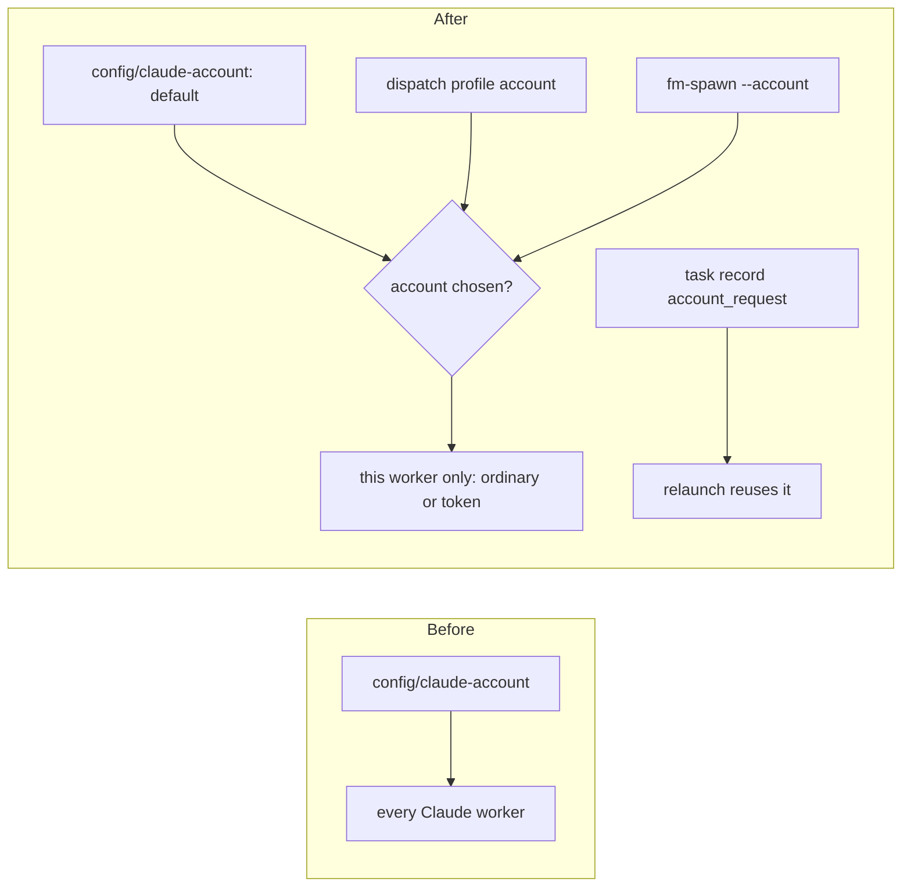

```mermaid
flowchart LR
  subgraph Before
    A1[config/claude-account] --> B1[every Claude worker]
  end
  subgraph After
    A2[config/claude-account: default] --> D{account chosen?}
    P[dispatch profile account] --> D
    F[fm-spawn --account] --> D
    D --> B2[this worker only: ordinary or token]
    M[task record account_request] --> R[relaunch reuses it]
  end
```
