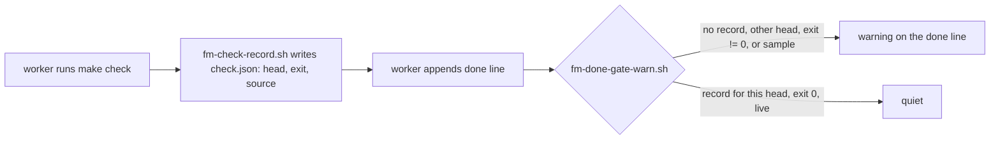

```mermaid
flowchart LR
  A[worker runs make check] --> B[fm-check-record.sh writes check.json: head, exit, source]
  B --> C[worker appends done line]
  C --> D{fm-done-gate-warn.sh}
  D -->|no record, other head, exit != 0, or sample| E[warning on the done line]
  D -->|record for this head, exit 0, live| F[quiet]
```
