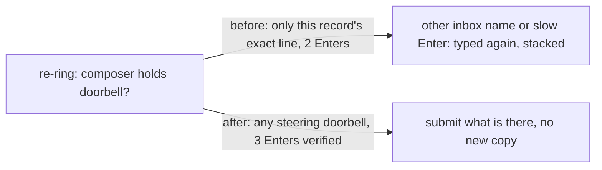

```mermaid
flowchart LR
  A[re-ring: composer holds doorbell?] -->|before: only this record's exact line, 2 Enters| B[other inbox name or slow Enter: typed again, stacked]
  A -->|after: any steering doorbell, 3 Enters verified| C[submit what is there, no new copy]
```
