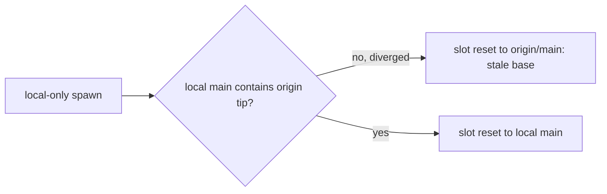
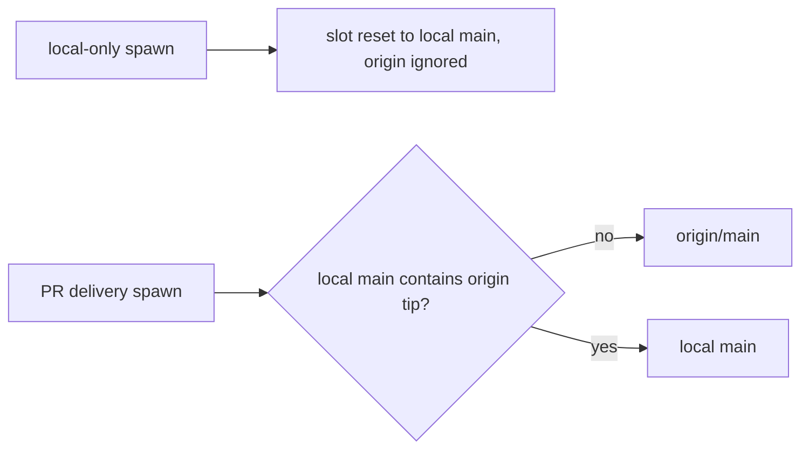

Before: a local-only spawn with a diverged local main resets the slot to origin/main.

```mermaid
flowchart LR
  A[local-only spawn] --> B{local main contains origin tip?}
  B -- no, diverged --> C[slot reset to origin/main: stale base]
  B -- yes --> D[slot reset to local main]
```

After: a local-only spawn always starts from the local default branch.

```mermaid
flowchart LR
  A[local-only spawn] --> D[slot reset to local main, origin ignored]
  P[PR delivery spawn] --> B{local main contains origin tip?}
  B -- no --> C[origin/main]
  B -- yes --> D2[local main]
```
