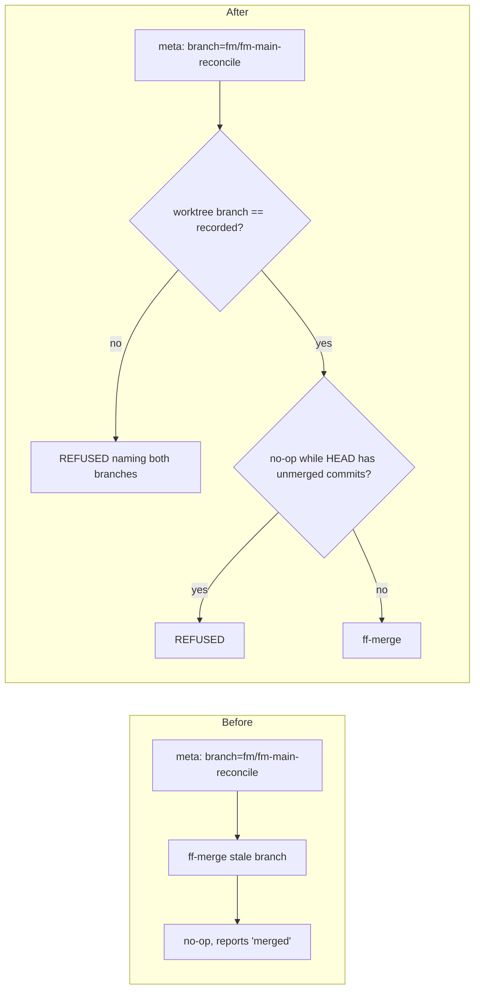

```mermaid
flowchart LR
  subgraph Before
    A1[meta: branch=fm/fm-main-reconcile] --> B1[ff-merge stale branch]
    B1 --> C1["no-op, reports 'merged'"]
  end
  subgraph After
    A2[meta: branch=fm/fm-main-reconcile] --> B2{worktree branch == recorded?}
    B2 -- no --> R1[REFUSED naming both branches]
    B2 -- yes --> B3{no-op while HEAD has unmerged commits?}
    B3 -- yes --> R2[REFUSED]
    B3 -- no --> M[ff-merge]
  end
```
