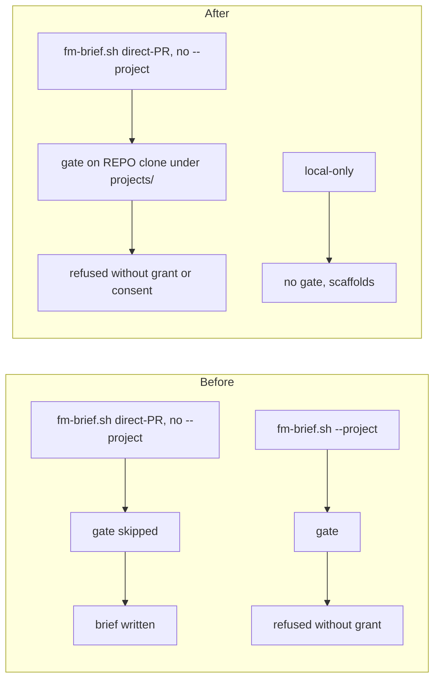

```mermaid
flowchart LR
  subgraph Before
    B1[fm-brief.sh direct-PR, no --project] --> B2[gate skipped] --> B3[brief written]
    B4[fm-brief.sh --project] --> B5[gate] --> B6[refused without grant]
  end
  subgraph After
    A1[fm-brief.sh direct-PR, no --project] --> A2[gate on REPO clone under projects/] --> A3[refused without grant or consent]
    A4[local-only] --> A5[no gate, scaffolds]
  end
```
