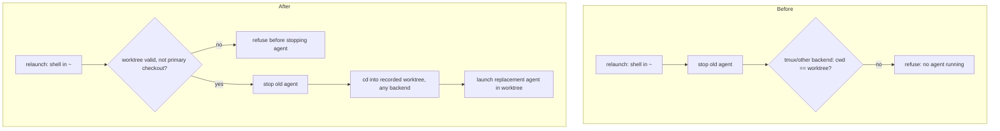

```mermaid
flowchart TD
  subgraph Before
    A1[relaunch: shell in ~] --> B1[stop old agent] --> C1{tmux/other backend: cwd == worktree?}
    C1 -- no --> D1[refuse: no agent running]
  end
  subgraph After
    A2[relaunch: shell in ~] --> P2{worktree valid, not primary checkout?}
    P2 -- no --> R2[refuse before stopping agent]
    P2 -- yes --> B2[stop old agent] --> C2[cd into recorded worktree, any backend] --> E2[launch replacement agent in worktree]
  end
```
