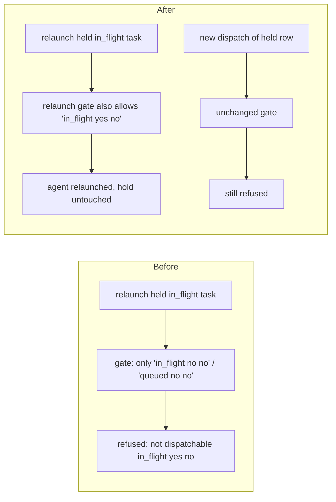

```mermaid
flowchart LR
  subgraph Before
    A1[relaunch held in_flight task] --> B1[gate: only 'in_flight no no' / 'queued no no'] --> C1[refused: not dispatchable in_flight yes no]
  end
  subgraph After
    A2[relaunch held in_flight task] --> B2[relaunch gate also allows 'in_flight yes no'] --> C2[agent relaunched, hold untouched]
    A3[new dispatch of held row] --> B3[unchanged gate] --> C3[still refused]
  end
```
