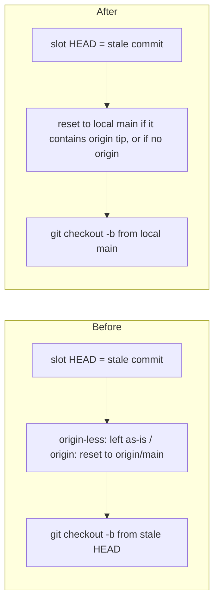

```mermaid
flowchart LR
  subgraph Before
    A1[slot HEAD = stale commit] --> B1[origin-less: left as-is / origin: reset to origin/main]
    B1 --> C1[git checkout -b from stale HEAD]
  end
  subgraph After
    A2[slot HEAD = stale commit] --> B2[reset to local main if it contains origin tip, or if no origin]
    B2 --> C2[git checkout -b from local main]
  end
```
