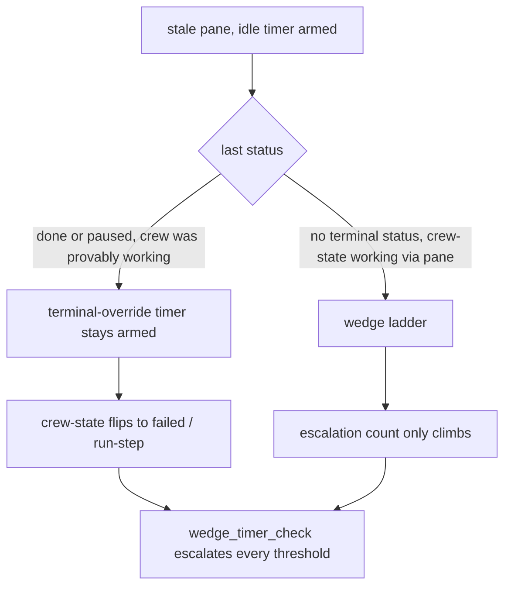
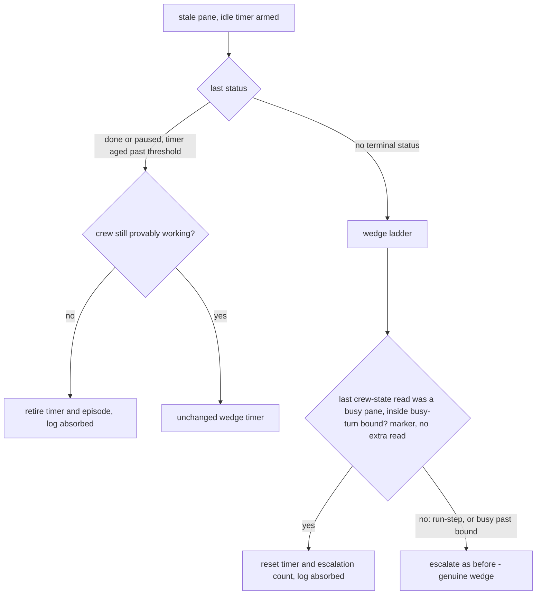

# Wedge alarm re-fire: before and after

## Before

```mermaid
flowchart TD
  A[stale pane, idle timer armed] --> B{last status}
  B -->|done or paused, crew was provably working| C[terminal-override timer stays armed]
  C --> D[crew-state flips to failed / run-step]
  D --> E[wedge_timer_check escalates every threshold]
  B -->|no terminal status, crew-state working via pane| F[wedge ladder]
  F --> G[escalation count only climbs]
  G --> E
```

## After

```mermaid
flowchart TD
  A[stale pane, idle timer armed] --> B{last status}
  B -->|done or paused, timer aged past threshold| C{crew still provably working?}
  C -->|no| H[retire timer and episode, log absorbed]
  C -->|yes| I[unchanged wedge timer]
  B -->|no terminal status| F[wedge ladder]
  F --> J{last crew-state read was a busy pane, inside busy-turn bound? marker, no extra read}
  J -->|yes| K[reset timer and escalation count, log absorbed]
  J -->|no: run-step, or busy past bound| L[escalate as before - genuine wedge]
```
