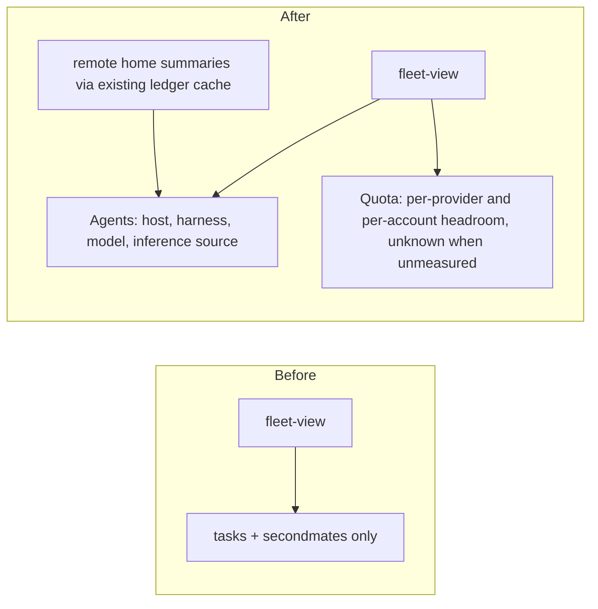

```mermaid
flowchart LR
  subgraph Before
    A1[fleet-view] --> B1[tasks + secondmates only]
  end
  subgraph After
    A2[fleet-view] --> B2[Agents: host, harness, model, inference source]
    A2 --> C2[Quota: per-provider and per-account headroom, unknown when unmeasured]
    R[remote home summaries via existing ledger cache] --> B2
  end
```
