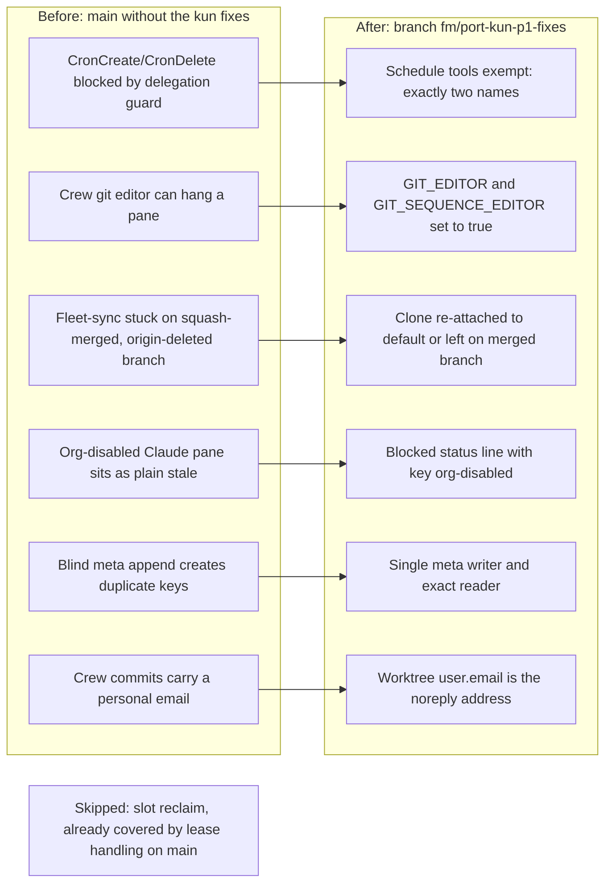

# Port of kun failure-mode fixes onto main

```mermaid
flowchart LR
  subgraph before[Before: main without the kun fixes]
    A1[CronCreate/CronDelete blocked by delegation guard]
    A2[Crew git editor can hang a pane]
    A3[Fleet-sync stuck on squash-merged, origin-deleted branch]
    A4[Org-disabled Claude pane sits as plain stale]
    A5[Blind meta append creates duplicate keys]
    A6[Crew commits carry a personal email]
  end
  subgraph after[After: branch fm/port-kun-p1-fixes]
    B1[Schedule tools exempt: exactly two names]
    B2[GIT_EDITOR and GIT_SEQUENCE_EDITOR set to true]
    B3[Clone re-attached to default or left on merged branch]
    B4[Blocked status line with key org-disabled]
    B5[Single meta writer and exact reader]
    B6[Worktree user.email is the noreply address]
  end
  A1 --> B1
  A2 --> B2
  A3 --> B3
  A4 --> B4
  A5 --> B5
  A6 --> B6
  S[Skipped: slot reclaim, already covered by lease handling on main]
```
