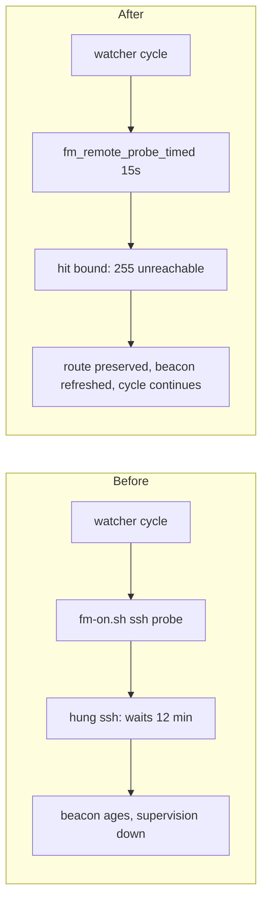

# Remote probe timeout: before -> after

```mermaid
flowchart LR
  subgraph Before
    A1[watcher cycle] --> B1[fm-on.sh ssh probe] --> C1[hung ssh: waits 12 min] --> D1[beacon ages, supervision down]
  end
  subgraph After
    A2[watcher cycle] --> B2[fm_remote_probe_timed 15s] --> C2[hit bound: 255 unreachable] --> D2[route preserved, beacon refreshed, cycle continues]
  end
```
