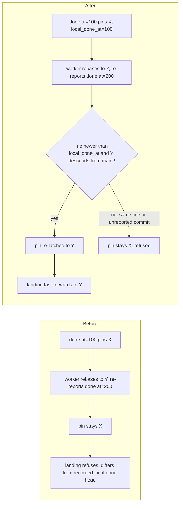

```mermaid
flowchart LR
  subgraph Before
    A1[done at=100 pins X] --> A2[worker rebases to Y, re-reports done at=200]
    A2 --> A3[pin stays X]
    A3 --> A4[landing refuses: differs from recorded local done head]
  end
  subgraph After
    B1[done at=100 pins X, local_done_at=100] --> B2[worker rebases to Y, re-reports done at=200]
    B2 --> B3{line newer than local_done_at and Y descends from main?}
    B3 -- yes --> B4[pin re-latched to Y]
    B4 --> B5[landing fast-forwards to Y]
    B3 -- no, same line or unreported commit --> B6[pin stays X, refused]
  end
```
